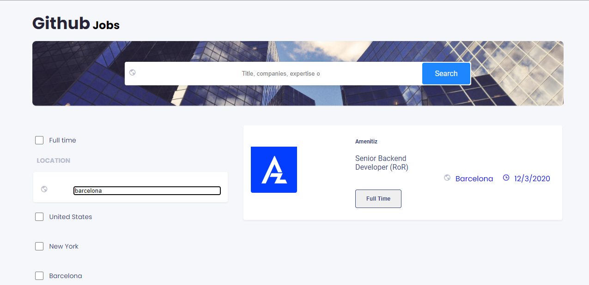

# Github Jobs

<div align="center">
  <h3>
    <a href="https://github-jobs-manjaka.netlify.app">
      Demo
    </a>
    <span> | </span>
    <a href="https://github.com/moro-patana/github-jobs">
      Solution
    </a>
  </h3>
</div>


This is a githubjob project which is based on search form and checkboxes. The purpose of this project is to help the user search for a job: name, company, and location etc.




[demo](https://github-jobs-manjaka.netlify.app) : https://github-jobs-manjaka.netlify.app


1. Experiences:

    - From this project, I understood how to use useReducer and how clean my code is.
    - I noticed that there are several way we can filter the data such as checkboxes and input form.
    - The most important thing that I experienced was it would be better to use useReducer from the begining so that it will be easy to deal with.

2. Steps:
    - Create the index.html and index.js.
    - Add script to the index.html which links to the index.js file.
    - I create an index.css file to store all the styles but we can use styled component if we want. We need to install styled components when we want want to use an inline styles.

           npm install styled-components


    - The most important is to create a context provider which contain all the states that will be used in another components. In one word, context provider is the parent and it share properties to its children.

    - I put all the components files in a folder called "Component" so that it is easy to link them.

    - In the context provider, I put all the states which are used in another components and I set the state and dispatch as values of the context provider.

    - I use switch statement because I have cases. I convert all the state into separated cases.

    - Everytime I updated the original array from data, I spread it.(immutable)

    - I filter the data by the job title in the first form input and by location in the second form input.
    - About the checkboxes, I compare the name of the city to the checkbox values and updated the original array into the filtered one.

    - About the details, I use UseParams to get the id of each job.

3. If I had more time, I would challenge the pagination and the loading state when we submit the value of the input.  

4. This project tought me on how to manage my time. What should I prioritize. What is amazing, the way how can we convert html elements in a string from the data. It was challenging but I solved it.

**NB**: It was surprising challenge because we can do our own research even though we have never done some of the challenge(e.g: using dabgerousInner html).

Built with:

  [React](https://reactjs.org/tutorial/tutorial.html#:~:text=React%20is%20a%20declarative%2C%20efficient,class%20ShoppingList%20extends%20React.)

  ## Features:
  ### How to use:

  To clone and run this application, you'll need Git and Node.js (which comes with npm) installed on your computer. From your command line:

  ```bash
      # Clone this repository
      $ git clone https://github.com/your-user-name/your-project-name

      # Install dependencies
      $ npm install

      # Run the app
      $ npm start
```
## Acknowledgement: 
 Each job should be an article to help you with layout but it is up to you.

## Contacts:
- [Website](https://github-jobs-manjaka.netlify.app): https://github-jobs-manjaka.netlify.app
 - [Github]("https://github.com/moro-patana/github-jobs): https://github.com/moro-patana/github-jobs
